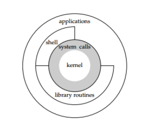

2019.12.29

## 2019.12.29

+ Linux简介

  1. Linux内核结构是宏内核结构

  2. ###### 架构

     

  3. Unix：

     1. Unix的体系结构分为3层，从内到外依次是：内核--系统调用--应用层
     2. shell：命令行解释器，它读取用户输入，然后执行命令。shell拥有很多版本，bash（Bourne-again shell），它位于/bin/bash

     

+ Linux常用指令

  + su exit

  + cd ： 

    + cd ..
    + cd ~

  + ls

    + ls -a 查看所有文件（包括隐藏文件： 在unbuntu中是以. 开头的文件）
    + ls -l 查看详细信息，包括权限：当前用户 主用户 其他用户
    + chmod修改权限：chmod *** file当前用户 u，主用户 g ，其他用户 o。
    + 权限简介：r（读） w（写） x（执行）， r = 4， w = 2， x =1
  + man + 命令：指南

  + echo 

    + echo hello //仅仅是显示在屏幕上
    + echo hello > 1.txt // 保存在1.txt中 // > 表示流动

  + 创建文件

    + 创建文件的方式
      + echo  > 1.txt 
      + touch 1.txt
      + vim 1.txt

  + 查看文件

    + cat

    + vim

    + head // head -#n file > n_file // 将file 的前n行存到n_file中

    + tail -f

    + more 文件名
              直接按回车： 一行一行往下走
              下一屏幕的内容： ctrl + f
              上一屏幕的内容： ctrl + b

      ​		退出查看文件内容: q   

  + cp复制  mv移动或者改名

  

  **vim编辑器   -->  编辑器之神**

  + Normal模式 
             h   向左移动
             j   向下移动
             k   向上移动
             l   向右移动

    ​		w   移动到下一个单词的首部
    ​		 e   移动到下一个单词的尾部
     		b   移动到上一个单词的首部

     		^   移动到行首  

     		$   移动到行尾

     		G   跳转到文档的末尾
     		gg  跳转到文档的开始
    + 复制操作:
          复制n行
          nyy  2yy  移动光标到要写入的位置， 再按p
    + 撤销上一次的操作： 按u
    + 删除操作:
          删除多行
          ndd  2dd 
    + nx  删除n个字符
    + dw  删除1个单词

  

  + Insert模式： 按  i 键 进行编辑
    + 按esc：Insert模式  --> Normal模式 
    + 将windows中的内容复制到vim中，需要使用 shift + insert键

  + 命令行模式
        :w<cr>     只保存，不退出
        :q<cr>     只退出
        :wq<cr>    保存退出
        :x<cr>    保存退出
        :q!        修改了内容，不保存退出

    ​	:200        跳转到任意数字行

    练习 VIM： vimtutor

    参考阅读
        https://fancyseeker.github.io/2014/05/15/vim1/

    ​	https://vim-adventures.com/

+ VMWare 的使用

  + 桥接方式     

    将ubuntu接入到本地局域网，与主机相同  192.168.3.xxx

  + 仅主机  VMnet1

  + NAT    VMnet8  

    以本机作为路由器，虚拟的是另一个局域网，且可能变化  192.168.44.xxx

  