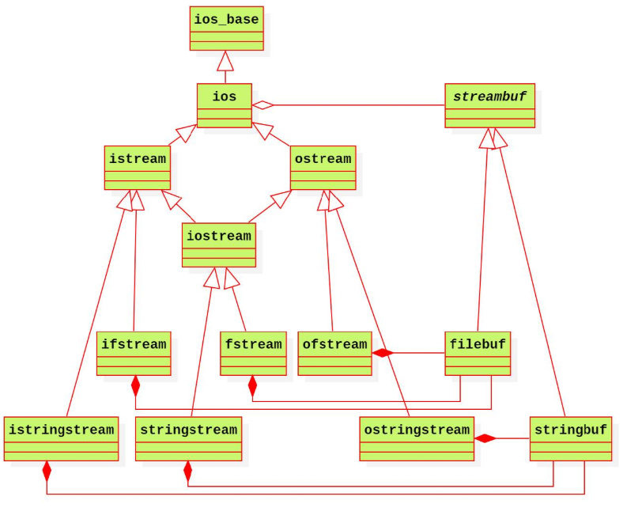

## 类

+ `new` 和 `delete`

  + `new`表达式 （`new`操作符要与`operator new`相区别）

    + `new`表达式的工作步骤有3：
1. 调用名为`operator new`的标准库函数，分配相应类型大小的原始的未类型化的内存
   
2. 运行该类型的构造函数初始化对象
   
3. 返回指向新分配并构造的构造函数对象的指针
   
+ ``delete``表达式
  
  + ``delete``表达式工作步骤：
      1. 调用该类的析构函数（对象是**数据成员**，即指针指向的内容）
      2. 调用`operator delete`标准库函数释放该对象所用的内存（对象是该**对象**，即该指针）
  
+ `operator new`和 `operator delete`的简单实现：注意参数和返回类型都是规定死的
  
  ```C++
    	void * operator new(size_t sz)	//size_t类型参数是规定的，必须有，sz的大小不需要主动传递，系统会自动完成
    	{
    		cout << "void * operator new(size_t)" << endl;
    		void * ret = malloc(sz);  // 只关心开辟空间，
            						// 而该空间要放什么类型的数据,它是不关心的
    		return ret;				// !!!返回一个void*类型，为申请空间的起始地址
    	}						   // void可以做任意类的基类 
    	void operator delete(void * p) //void* p 形参必须有，不会有返回值，返回void
    	{
    		cout << "void operator delete(void*)" << endl;
    		free(p);
    	}
  ```
  
+ 系统执行结果：体现了操作符`new`、`delete`的工作步骤
  
  ``` 
  ray@ubuntu:~/cpp/200106/teach$ ./a.out 
    void * operator new(size_t)
    Student(const char*, int)
    name:Mike
    id: 100
    ~Student()
    void operator delete(void*)
  ```
  
  + 要求一个类只能创建栈对象
  
  + 即需要
  
    ```C++
    Student s1(101, "John");//ok
      Student * stu = new Student(101, "Mark");//error
    ```
  
    + 只需要将`operator new` 和 `operator delete`放入Student类的`private`区域，则`new`表达式无法完成，且这里**两个函数不用调用甚至可以不用实现，只需申明即可**。
  
+ 要求一个类只能创建堆对象
  
  + 即需要
  
    ```C++
    Student s1(101, "John");//error
      Student * stu = `new` Student(101, "Mark");//ok
    ```
  
    + 将Student类的析构函数放入private区域，此时`delete`不是类内部的函数，无法调用private成员函数，故必须再加上一个public的destroy函数，包含`delete`表达式，则会依次调用private的析构函数和operator `delete`函数。**注意`delete`过程和operator `delete`的区别的理解** 
  
+ C++输入输出流
  
  + 流：C++ 的 I/O 发生在流中，流是字节序列。
  
    + 流类型之间的继承关系：
  
    
  
    + 流的四种状态：是类`ios_base`的数据成员
  
      + ` badbit `表示发生系统级错误，流无法再使用
      + ` failbit `表示可恢复的错误。eg 期望读数值，读了一个字符
      + `eofbit` 当到达文件的结束位置时， ` eofbit `和`failbit`都会被置位。
      + `goodbit`被置位表示流未发生错误。
  
    + 流的查询和操作：
  
      ```C++
      bool bad() const; //若流的badbit置位，则返回true;否则返回false
      bool fail() const; //若流的failbit或badbit置位，则返回true;  ???
      // 参考最下方的图片，确实如此https://en.cppreference.com/w/cpp/io/basic_ios/eof
      bool eof() const; //若流的eofbit置位，则返回true;
      bool good() const; //若流处于有效状态，则返回true;
      iostate rdstate() const; //获取流的状态
      void setstate(iostate state); //设置流的状态
      
      //clear的无参版本会复位所有错误标志位*(重置流的状态)
      void clear(std::ios_base::iostate state = std::ios_base::goodbit);
      
      cin.clear();  //重置流的状态
      ```
      
    + 特别地，
    
      ```C++
      void readInteger(std::istream & is, int & number)
      {
      	cout << "pls input a valid integer:" << endl;
      	while(is >> number, !is.eof()) //这里is.eof()除了使用Ctrl+D，都会保持false的状态，即永远不会到达结尾
              //在屏幕上打出一些内容，就进入缓冲区，在按回车之前不会刷新缓冲区
       ///...
      ```
    
      
    
  + 标准输入流的一些操作：
    
    + ctrl + d , 结束输入
      + ctrl + c , 通过信号终止程序
      + ctrl + z , 将当前任务在后台挂起
    
  + 缓冲区：一块缓冲输入或输出的数据的内存区
  
    + 类型
      + 全缓冲：当填满标准I/O 缓存后才进行实际I/O 操作。eg 对磁盘文件的读写。
      + 行缓冲：当在输入和输出中遇到换行符时，执行真正的I/O 操作。eg键盘输入数据，``cout``
      + 非缓冲：也就是不进行缓冲，标准出错情况cerr/stderr 是典型代表，这使得出错信息可以直接尽快地显示出来。
  
  + `cerr` 和`clog`的区别：它们俩都是标准错误流，区别在于`cerr` 不经过缓冲区，直接向终端输出信息，而`clog` 中的信息是存放在缓冲区的，缓冲区满后或遇到endl 向终端输出。
  
  + 清空缓冲区
  
    ```C++
    cin.ignore(std::numeric_limits<std::streamsize>::max(), '\n');// 清空缓冲区
    ```
  
  + 输出缓冲区刷新：输出缓冲区的内容写入到广义文件
  
    + 导致刷新的情况：
  
      + 程序正常结束（有一个收尾操作就是清空缓冲区）；
      2. 缓冲区满（包含正常情况和异常情况）；
      3. 使用操纵符显式地刷新输出缓冲区，如： `endl` 、`ends` 、`flush` ；
      4. 使用`unitbuf` 操纵符设置流的内部状态；
      + 输出流与输入流相关联，此时在读输入流时将刷新其关联的输出流的输出缓冲区。
  
    + 使用操作符刷新：
  
      + endl : 用来完成换行，并刷新缓冲区
  
      + ends : 在输入后加上一个空字符，然后再刷新缓冲区
  
      + flush : 用来直接刷新缓冲区的
  
      + unitbuf : 在每次执行完写操作后都刷新输出缓冲区
  
      + nounitbuf : 让流回到正常的缓冲方式
  
        ```C++
        void test8()
        {
        	cout << "hello, world!" << endl;//立刻换行输出
        	cout << "hello, 德玛西亚Garen";//不确定啥时候会输出
        	sleep(5);
        	cout << "hello, 寒冰射手Ashe" << ends;
        	cout << "hello, 无极剑圣Master Yi" << flush;
        	cout << unitbuf << "hello, 齐天大圣Wukong" << nounitbuf;
        }
        ```
  
    + C++ 文件IO
  
      + ifstream （文件输入流）, ofstream （文件输出流）, fstream （文件输入输出流）
  
        + 读文件的文件必须存在，默认in模式
        + 写文件的文件相当于直接创建新文件覆盖，默认out模式
        + 注意使用.close()
  
      + **文件模式**一共有六种，是位于ios_base 类的枚举类型，它们分别是:
  
        + in : 输入，文件将允许做读操作；如果文件不存在，打开失败
        + out : 输出，文件将允许做写操作；如果文件不存在，则直接创建一个
        + app : 追加，写入将始终发生在文件的末尾
        + ate : 末尾，写入最初在文件的末尾
        + trunc : 截断，如果打开的文件存在，其内容将被丢弃，其大小被截断为零
        + binary : 二进制，读取或写入文件的数据为二进制形式
  
        eg
  
        ```C++
        std::ofstream ofs("text1.txt", std::ios::app);//在文件末尾添加
        ```
  
      + 调整文件内指针的位置
  
        ```C++
        //ifstream
        tellg
      ifs.seekg(std::ios::beg);//偏移文件游标的位置
        //ofstream
          tellp
        seekp
        ```
    
    + 可以做到的一些操作：
    
        + 按字符、按分隔符(>> 空格分隔)、按行(.getline())读取文件
        + 写文件，在文件末添加数据
      + 复制文件
    
    + C++字符串IO
    
      + istringstream （字符串输入流），ostringstream （字符串输出流），stringstream （字符串输入输出流）,在\<sstream\> 中
      + 无.close()
      + eg
    
      ``` C++
    string int2str(int number)
      {
      	ostringstream oss;
      	oss << number;
      	return oss.str(); // num->string
      }
      ```
    
      
  
+ 小点
  + `new` 和 malloc的区别 参考
    + https://www.zhihu.com/question/30115922/answer/93257751
    + https://blog.csdn.net/nie19940803/article/details/76358673
    
  + **头文件include顺序：自定义库 > C 的头文件 > C++ 的头文件 > 第三方库**
  
  + 读读自己关心的源码，保持好奇心
  
  + 不确定的函数，man一下可以找它的头文件
  
  + 
  
  ```C++
    //两个是有区别的！！！
  string s1 = "hi";	//“hi”由char[]强制转换为string，再调用拷贝构造函数
    string s2("hi"); 	//使用“hi”调用带参的构造函数
  ```
  
+ ++符号在前比在后效率高一些
  
  + `explicit`：加在构造函数前，可以避免其隐式转换
  
  + 逗号表达式 ：c语言提供一种特殊的运算符，优先级别最低，它将两个及其以上的式子联接起来，从左往右逐个计算表达式，整个表达式的值为最后一个表达式的值。
  
  + eg a=(a=3*5,a*4)的值是60
    + [https://baike.baidu.com/item/%E9%80%97%E5%8F%B7%E8%A1%A8%E8%BE%BE%E5%BC%8F/4496335](https://baike.baidu.com/item/逗号表达式/4496335)

+ 代码问题

  + `new` ... ()      //最后要加上（），代表初始化

  + 写代码的时候，写几个测试，然后测试几个，再继续写，以免最后报一大堆bug

  + `delete` 之后，也要赋值一个nullptr，以避免野指针

    ```C++
    ~string()
    {
        if (pstr != nullptr)
        {
            delete [] pstr;
            _pstr = nullptr; // 注意再赋值为nullptr，以避免野指针
        }    
    }
    ```

  + `size_t`类型：

    + 相当于`unsigned int`，是数组、`vector`下标的实际类型，也是`sizeof`的返回类型
    + 有利于平台移植性
    + https://baike.baidu.com/item/size_t

  + `auto`是c++程序设计语言的关键字。用于两种情况

    1. 声明变量时根据初始化表达式自动推断该变量的类型

    2. 声明函数时函数返回值的占位符

       参考 https://blog.csdn.net/xiaoquantouer/article/details/51647865

    ```C++
    auto f = 3.14;  //double
    auto s("hello");  //const char*
    auto x1 = 5, x2 = 5.0, x3 = 'r';   //错误，必须是初始化为同一类型
    
    std::vector<int> vect; 
     for(auto it = vect.begin(); it != vect.end(); ++it) //舒服啊！！！
     {  //it的类型是std::vector<int>::iterator
        std::cin >> *it;
      }
    ```
  
+ string2char: 
  
  ```C++
    string a;
    char b[] = a.c_str(); //注意写（），这是个成员函数
  ```
  
  