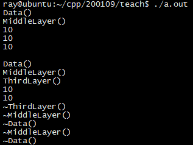

## 复习

+ read()方法获取确定数量的字节数

## 友元

+ 可以访问类的`private`成员

+ 格式 `` friend`` + 友元内容

+ 种类（注意要在friend前声明友元内容）

  + 全局友元函数

  + 友元类

    + 注意：

    ```C++
    class point; //类的前项声明
    ```

  + 友元成员函数

+ 友元的声明是不受public/protected/private 影响

+ 理解

  + 破坏了信息隐藏机制
  + 限制性：**单向、不具备传递性、不能被继承**

## 运算符重载

+ 实质：函数重载或函数多态(静态多态)

+ 目的：为了使对用户自定义数据类型的数据的操作与内置的数据类型形式一致

+ 重载规则：
  1. 为了防止用户对标准类型进行运算符重载， C++ 规定重载的运算符的操作对象必须至少有一个是自定义类型或枚举类型
  2. 不能臆造一个并不存在的运算符，如@、$等
  3. 不可以重载的运算符:  ``.`` ``.*`` ``?:`` ``::`` ``sizeof`` (基本都带点)
  4. 重载运算符之后，其优先级和结合性还是固定不变的。
  5. 重载逻辑运算符（ && , || ）后，不再具备短路求值特性。
  6. 重载不会改变运算符的用法，原来有几个操作数、操作数在左边还是在右边，这些都不会改变。
  7. 重载运算符函数不能有默认参数，否则就改变了运算符操作数的个数。

+ 重载原则：

  1. 要符合该符号的一般使用逻辑
  2. 用成员函数重载二元运算符时，左操作数无须用参数输入，而是通过隐含的this指针传入。若不能接受第一个参数为this指针，应写在类的外部。
  3. 返回值要能当左值，就要返回引用
  4. 表达式执行完毕后，左操作数发生变化，最好以成员函数形式重载
  5. 一旦有一个类似功能的成员操作符号函数，其他的可以直接利用它访问private数据成员。

+ 重载的三种形式(使用优先级从上至下)
  + 普通函数
  + 友元函数
  + 成员函数
    + 用成员函数重载双目运算符时，左操作数无须用参数输入，而是通过隐含的this 指针传入。

+ 具体的

  ```C++
  返回类型 operator 运算符（参数列表）;
  ```

  + 自增 operator++()

    + 一个操作数，最好放类内

    ```C++
    //前置形式：返回的是变化之后的值
    //可以连用++(++a)
    //可见:连用得返回 & 类型
    //不需要额外构造一个对象、不需要返回副本，所以效率更高
    	Complex & operator++();
    
    //后置形式 ？？？为什么不用返回Complex&  return *this？？？
    // 因为要返回的是变化之前的值
    // (c1++)++ 就不能用了？？对，没错，系统自带的也不行，这是一个右值
    	Complex operator++(int); //int作为标记，并不传递参数
    ```

  + operator+=

    + 表达式执行完毕后，左操作数发生变化，最好以成员函数形式重载

      ```C++ 
      Complex & operatpr+=(const Complex &);//返回也可以是非引用，只是要再调用构造函数
      ```

    + 一旦有一个类似功能的成员操作符号函数，其他的可以直接利用它访问private数据成员。

  + 函数调用运算符 operator() (参数表)

    + 相当于对象变成函数名字
    + 参数数量可以不定
    + 区别于一般全局函数的无记忆性（执行完后啥都没有了），对象函数的作用在于可以存数据成员，表示函数的某些状态
    + **把函数当成对象，返回值参数表确定的函数就是一种类型**
    + 如果主要想写函数，建议写成struct

    ```C++
    void operator()(int x)
    {
    	cout << " x = " << x << endl;
    }
    int operator()(int x, int y)
    {
    	return x + y;
    }
    ```

    

  + 下标operator[]

    + 返回值要能当左值，就要返回引用
    + 用成员函数重载双目运算符时，左操作数无须用参数输入，而是通过隐含的this 指针传入
  + 注意下标类型不一定是整型
  
  ```C++
  //声明格式
  返回类型 & 类名::operator[](参数类型);
  返回类型 & 类名::operator[](参数类型) const; //？？？
  
  //实现类数据成员有一个char指针的（char动态数组）
  char & operator[](int idx)
  {
      if(idx >= 0 && idx < size)
      {
          return pdata[idx];
      }
      else 
      {
      	static char nullchar = '\0'; //越界的一种处理方式
          return nullchar;
      }   
  }
  const char & operator[](int idx) const
  {
  	return _array[idx];
  }
  
  ```
  
  + 成员访问运算符  `->` ,  解引用运算符`*`
      + 箭头运算符只能以成员函数的形式重载，其返回值必须是一个指针或者重载了箭头运算符的对象。
      
      + 用一个对象来管理堆空间资源
      
      + 一个例子，很神奇的省略和自动释放
```
      #include <iostream>
      using std::cout;
      using std::endl;
      
      class Data
      {
      public:
      	Data() {cout << "Data()" << endl;	}
      
      	int getData() const {	return _data;	}
      
      	~Data() {	cout << "~Data()" << endl;	}
      
      private:
      	int _data = 10;
      };
      
      class MiddleLayer
      {
      public:
      	MiddleLayer(Data * pdata)
      	: _pdata(pdata)
      	{
      		cout << "MiddleLayer()" << endl;
      	}
      
      	//指针访问运算符
      	//返回的是一个指针
      	Data * operator->()
      	{
      		return _pdata;
      	}
      
      	Data & operator*()
      	{	return *_pdata;	}
      
      	~MiddleLayer()
      	{
      		cout << "~MiddleLayer()" << endl;
      		delete _pdata;
      		_pdata = nullptr;
      	}
      
      private:
      	Data * _pdata;
      };
      
      class ThirdLayer
      {
      public:
      	ThirdLayer(MiddleLayer * pml)
      	: _pml(pml)
      	{
      		cout << "ThirdLayer()" << endl;
      	}
      
      	//返回的是一个重载了指针访问运算符的对象
      	MiddleLayer & operator->()
      	{
      		return *_pml;
      	}
      
      	~ThirdLayer()
      	{	
      		cout << "~ThirdLayer()" << endl;
      		delete _pml;
      		_pml = nullptr;
      	}
      
      private:
      	MiddleLayer * _pml;
      };
       
      int main(void)
      {
      	/* Data * p; */
      	/* p->getData(); */
      	/* (*p).getData(); */
      
      	//用一个对象来管理堆空间的资源
      	//
      	//智能指针的雏形
      	MiddleLayer ml(new Data());
      	cout << ml->getData() << endl;
      	cout << (*ml).getData() << endl;
      	
      	cout << ml.operator->()->getData() << endl << endl;
      
      	ThirdLayer tl(new MiddleLayer(new Data())); 
      	cout << tl->getData() << endl; //中间的自动省略了
      	cout << (tl.operator->()).operator->()->getData() << endl; 
      	
      	return 0;
      }
```

运行结果

  

  + 输入输出流运算符 `<<`  ,  `>>`
  
    + 放类内的话，第一个参数只能是this指针，但实际上，左操作数是流对象ostream/istream，必须作为第一个参数，故只能放类的外部
    + 而且需要访问private 成员，需设为friend
    + 所有流对象不能进行复制，作为参数和返回值必须是引用

## 编程

+ test（）单独写出来，别放main

+ 以后要将方法用类封装起来

+ 代码可读性：
  + 变量、函数命名
  + 对齐、缩进
  
+ 写程序的时候，类似功能的函数要写成一个

+ 默认构造函数（） =  default，可以直接给数据成员赋初值

+ 智能指针

+ 类内不想以任何方式使用的函数，加上``= delete``

+ 让用户输入一个整数的代码：

  ```C++
  void readInteger(std::istream & is, int & number)
  {
  	cout << "pls input a valid integer:" << endl;
  	while(is >> number, !is.eof()) {//这里is.eof()除了使用Ctrl+D，都会保持false的状态，即永远不会到达结尾
  		if(is.bad()) {
  			std::cerr << "istream has corupted\n";
  			return;
  		} 
  		if(is.fail()) {
  			is.clear();//将状态调回正常
  			is.ignore(std::numeric_limits<std::streamsize>::max(), '\n');//将缓存区内容全部丢掉
  			cout << "pls input a valid integer:" << endl;
  			continue;
  		}
  		break;
  	}
  }
  ```

  

## 小点

+ 机器学习基础数学课推荐 
  + 《随机过程》 预测
  + 《组合数学》 
  + 《计算理论》 NP问题  状态机  编译原理
  
+ .* 的意义

+ `sizeof`是运算符（操作符），可以直接用 `sizeof 某变量` ，不用加括号； 但要直接作用于类型，必须`sizeof(int)` 

+ 短路求值

+ static数据成员可以用default的方式吗？

  + 不可以，但static const 可以

+ 函数指针；函数闭包 ，lambda， 匿名函数

  ```C++
  void test0()
  {
  	Foo c1;//对象
  	int a = 1, b = 2, c = 3;
  
  	//函数对象： 重载了函数调用运算符的类创建的对象
  	//			 携带了状态的函数
  	//函数闭包 ==> lambda表达式 ==> 匿名函数
  	cout << "c1(a, b) : " << c1(a,b) << endl;
  	cout << "c1(a, b, c): " << c1(a, b, c) << endl;
  
  	cout << "c1.count(): " << c1.count() << endl;
  	
  	func();
  
  	//自动推导类型
  	//auto f = [=](int x){	//通过值传递方式捕获上下文信息
  	auto f = [&](int x){//通过引用传递方式捕获上下文信息
  		int m = a;
  		int n = b;
  		int s = c;
  		cout << "hello,world, x :" << x << endl;	
  		cout << "a = " << a << endl
  			 << "b = " << b << endl
  			 << "c = " << c << endl;
  	};
  	f(10);
  }
  ```

  


## 其他

+ GCC来自于GNU运动 。参考 GNU 是什么，和 Linux 是什么关系？ - 知乎 https://www.zhihu.com/question/319783573/answer/656033035

+ Typora 快捷键 https://www.cnblogs.com/hongdada/p/9776547.html

  