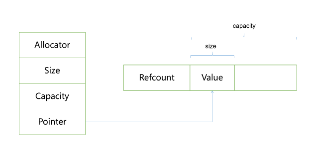
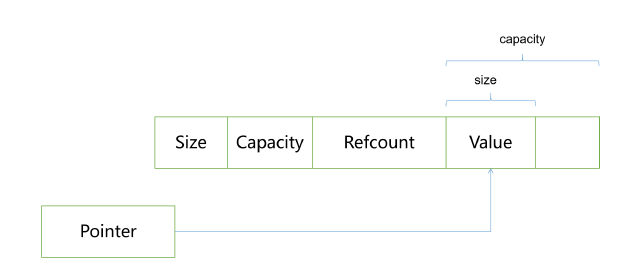
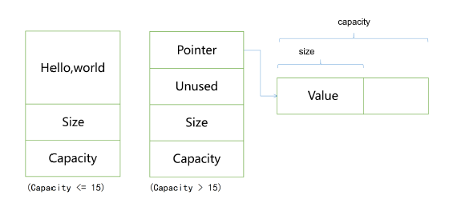

## C++风格的字符串 string

1. C 与 C++风格的字符串对比

2. **string的底层实现**（面试精华）
   
   + 每种实现都包含了：
     + 字符串的大小
     + 能够容纳的字符数量
     + 字符串内容本身
   
   1. Eager Copy(深拷贝)
   
      + 评价：这种实现方式，在需要对字符串进行频繁复制而又并不改变字符串内容时，效率比较低下。
      
   2. COW（Copy-On-Write 写时复制） ubuntu 1404
      + 当两个string发生复制构造或者赋值时，不会复制字符串内容，而是增加一个引用计数，然后字符串指针进行浅拷贝，其执行效率为O(1)。
      
      + 只有当需要修改其中一个字符串内容时，才执行真正的复制。
      
      + 线程安全问题！
      
      + 思考：发生拷贝时要复制一个指针，对小字符串来说，为啥不直接复制整个字符串呢，说不定还没有复制一个指针(8B，在64位机上)的代价大。
      
      + 老师的实现思路：数据成员`char*` new的时候会多new 4字节放前面给 int 的 `Refcount` 用，并随之伴生3个private函数 `init` `increase` `decrease` 
      
        + 
        + 以
      
        ```c++
        class String
        {
        public:
            String():_pstr(new char[5]() + 4)// () for init
                							 // +4是使其指向字符串
            {
                initRefcount();
            }
        //...
        private://增加可读性
            	//写在类内，是inline函数，不会损失效率
            void initRefcount(){   
                *(int *)(_pstr - 4) = 1;
            }
            void increaseRefcount(){
                ++*(int *)(_pstr - 4);
            }
            void decreaseRefcount(){
                --*(int *)(_pstr - 4);
            }
            void release()
            {
                decreaseRefcount();
                if (getRefcount() == 0)
                {
                    delete [] (_pstr - 4);
                }
        private:
                char *_pstr;
        //...   
        }
        ```
      
      + 两种实现：
      
        1. 
        
        ```C++
        class string {
        private:
            Allocator _allocator;
            size_t size;
            size_t capacity;
            char * pointer;
        };
        ```
        
        
        
        2. 
        
      + **区分operator[]输入还是输出**
      
        + char是内置类型 不能重载运算符，需要将s[1]返回值变为自定义类型
        + 代理模式 ： https://blog.csdn.net/qq_36459536/article/details/79042141
      
   3. SSO(Short String Optimization-短字符串优化)ubuntu 1804
      + 当字符串的长度**小于等于**15个字节时，buffer直接存放整个字符串；
   
      + 当字符串**大于**15个字节时，buffer存放的就是一个指针，指向堆空间的区域。（拷贝构造函数，依然是深拷贝，与写时复制相区别）
   
      + 这样做的好处是，当字符串较小时，直接拷贝字符串，放在string内部，不用获取堆空间，开销小。
   
      + 实现
      
        
      
        ```C++
        class string {
        	union Buffer{
        		char * _pointer;
        		char _local[16];
        	};
        	
            Buffer _buffer;
        	size_t _size;
        	size_t _capacity;
        };
        ```
      
        
      
   4. 最佳策略：facebook开源的folly库实现的fbstring
   
      1. 很短的（0~22）字符串用SSO，23字节表示字符串（包括'\0'）,1字节表示长度
      2. 中等长度的（23~255）字符串用eager copy，8字节字符串指针，8字节size，
      8字节capacity.
      3. 很长的(大于255)字符串用COW, 8字节指针（字符串和引用计数），8字节
      size，8字节capacity.
   
   5. 线程安全性


## 编程

1. string标准库里的c_str()用法： `const CharT* c_str() const;`
   
   + https://en.cppreference.com/w/cpp/string/basic_string/c_str
   
2. ```c++
   char * ch = new char[5]() //最后的()是为了初始化的！
   ```

3. 重载`operator=`，要先考虑是否会自复制！！！

4. int main()里的参数表？？？

5. 代理类 ？？？https://my.oschina.net/abcijkxyz/blog/723313


## 小点

1. ubuntu和windows传输小文件  （sudo apt-get install lrzsz）

   + sz filename : 下载到windows

   + rz –be : 上传

2. git中要大幅度修改文件数量和结构，用 `git commit -am"..."` 代替 `git commit -m"..."`

   参考 https://www.jianshu.com/p/cb035bac33b5

3. 常用git指令 参考 https://blog.csdn.net/u012526120/article/details/49401871

   ``` 
   最常用的 git 命令有：
      add        添加文件内容至索引
      bisect     通过二分查找定位引入 bug 的变更
      branch     列出、创建或删除分支
      checkout   检出一个分支或路径到工作区
      clone      克隆一个版本库到一个新目录
      commit     记录变更到版本库
      diff       显示提交之间、提交和工作区之间等的差异
      fetch      从另外一个版本库下载对象和引用
      grep       输出和模式匹配的行
      init       创建一个空的 Git 版本库或重新初始化一个已存在的版本库
      log        显示提交日志
      merge      合并两个或更多开发历史
      mv         移动或重命名一个文件、目录或符号链接
      pull       获取并整合另外的版本库或一个本地分支
      push       更新远程引用和相关的对象
      rebase     本地提交转移至更新后的上游分支中
      reset      重置当前HEAD到指定状态
      rm         从工作区和索引中删除文件
      show       显示各种类型的对象
      status     显示工作区状态
      tag        创建、列出、删除或校验一个GPG签名的 tag 对象
   
   ```

4. git 新建本地仓库与GitHub连接 ：https://blog.csdn.net/u012526120/article/details/49401871

   https://blog.csdn.net/wingter92/article/details/77822141