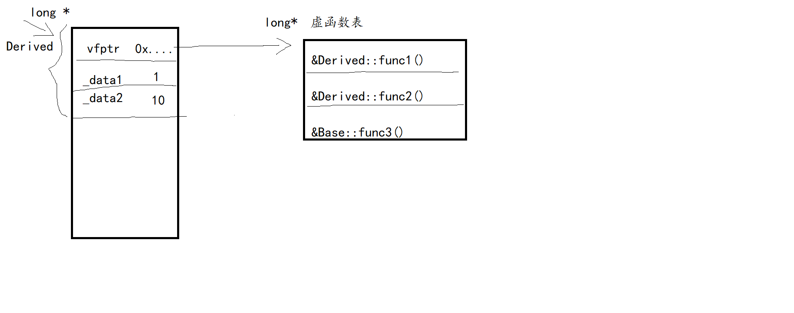
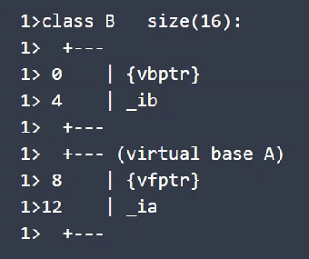
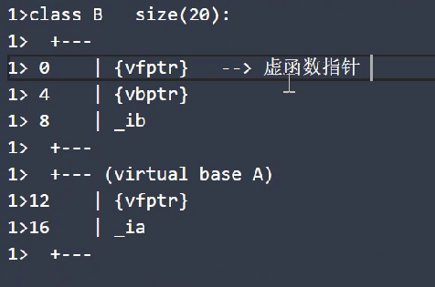
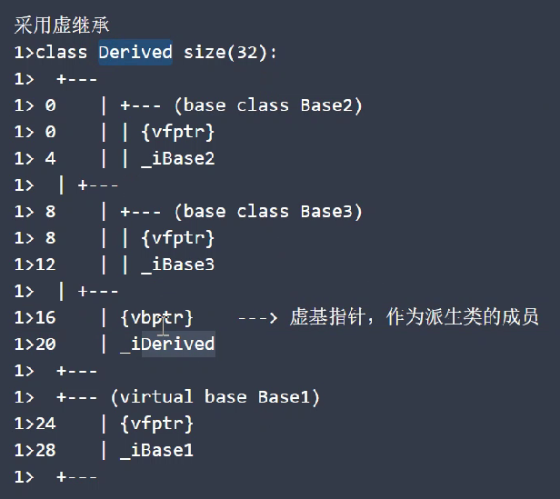
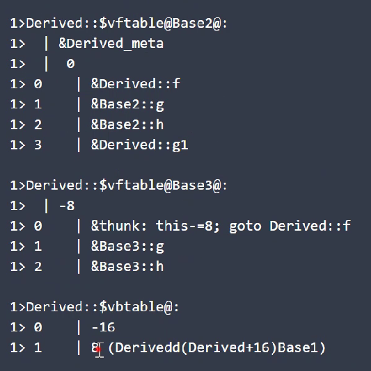
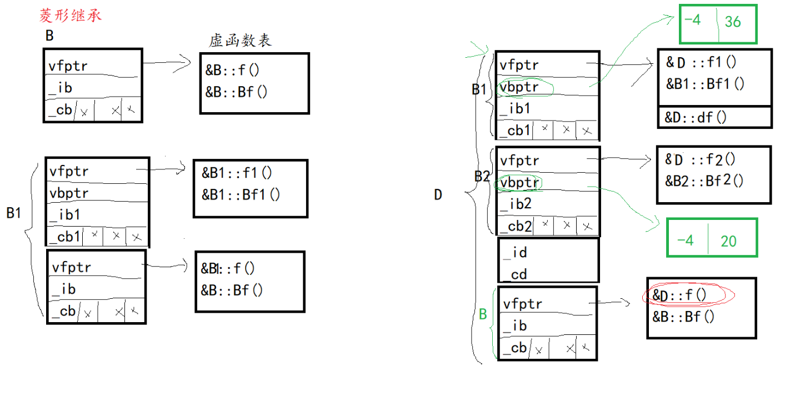
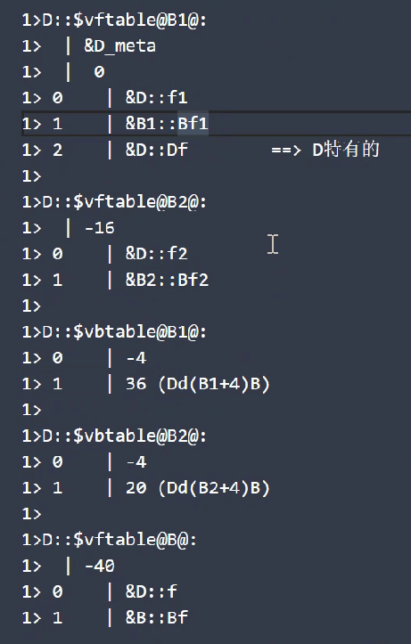
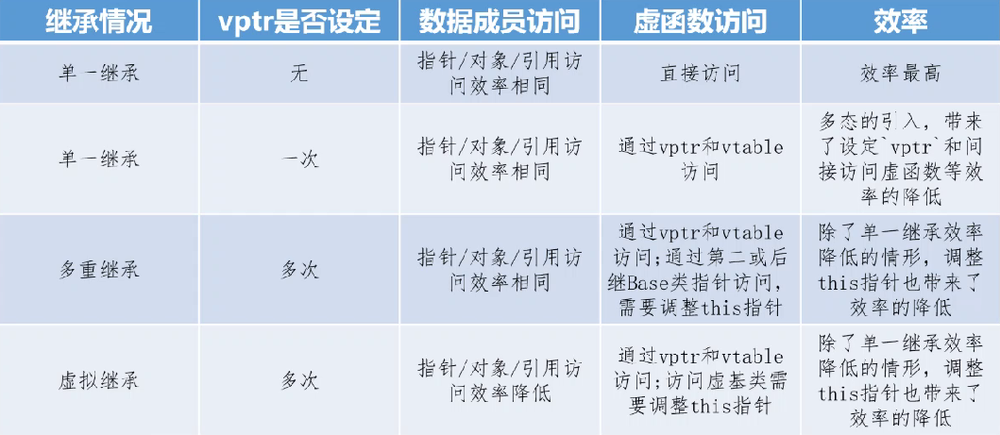

## 虚拟继承

1. 什么是`virtual`？
   1. `Existing or resulting in essence or effect though not in actual fact, form, or name.`实质上的，实际上的：虽然没有实际的事实、形式或名义，但在实际上或效果上存在或产生的；
   2. `Existing in the mind, especially as a product of the imagination. Used in literary criticism of text.` 虚的，内心的：在头脑中存在的，尤指意想的产物，用于文学批评中。
2. 虚函数的特点：**存在**、**间接**和**共享**
   1. 虚函数是存在的
   2. 虚函数必须要通过一种间接的运行时（而不是编译时）机制才能够激活（调用）的函数
   3. 共享性表现在基类会共享被派生类重定义后的虚函数
3. 虚拟继承的表现方式
   1. 存在即表示虚继承体系和虚基类确实存在
   2. 间接性表现在当访问虚基类的成员时同样也必须通过某种间接机制来完成（通过**虚基表**来完成）
   3. 共享性表现在虚基类会在虚继承体系中被共享，而不会出现多份拷贝
4. 虚拟继承的形式： 继承列表中加上`virtual` 关键字

## 虚拟继承布局

1. 对于非虚拟的继承，派生类头部是虚函数表指针，指向虚函数表，虚函数表存了各个虚函数的入口地址（包括被覆盖的和没被覆盖的）    ？？？？假如在派生类定义了新的虚函数，应该也在里面？？？

   没有虚继承的时候：？？？整个类用一张虚函数表吗？？？是的

   

   **下面演示是在32位系统上的** `_ib` `_ia`都是4B的`int`

2. 单个虚继承，不带虚函数

   1. 多一个虚基指针，作为派生类成员
   2. 虚拟继承的基类放在最末尾

   

3. 单个虚继承，基类带虚函数，派生类不含虚函数

   1. 派生类没有自己的虚函数，此时派生类对象不会产生vfptr

   2. 位于尾部的基类，vfptr放最前

      

4. 单个虚继承，基类派生类都含有虚函数

   1. 派生类有自己的虚函数，派生类的vfptr放在派生类对象存储空间最开始的位置

   2. vbptr在派生类vfptr后

      + 虚函数指针放在对象存储布局的开始位置，是为了效率 ，为了可以直接调用

      

5. 多重继承，带虚函数

   1. 每个基类都有自己的虚函数表

   2. 派生类如果有自己的虚函数，会被加入到第一个虚函数表之中

   3. 内存布局中，其基类的布局按照基类被声明时的顺序进行排列

   4. 派生类会覆盖基类的虚函数，只有第一个虚函数表中存放的是真实的被覆盖的函数的地址；其它的虚函数表中存放的并不是真实的对应的虚函数的地址，而只是一条跳转指令

      内存布局

   

   2. 表内内容

      

6. 钻石型虚继承

   1. 虚基指针的第一条内容表示的是该虚基指针距离**所在的子对象的首地址**的偏移
   2. 虚基指针的第二条内容表示的是该虚基指针距离**虚基类子对象的首地址**的偏移





## 效率分析

通过以上的学习我们可以知道，多重继承和虚拟继承对象模型较单一继承复杂的对象模型，造成了成员访问低效率，表现在两个方面：对象构造时`vptr`的多次设定，以及`this`指针的调整。对于多种继承情况的效率比较如下：




## 移动语义

1. 左值(lvalue)和右值(rvalue) C++11特性

   1. 针对于表达式而言的
      1. 左值：持久化对象，能取地址的值
      2. 右值：非持久化对象，不能取地址
         + eg String("hi") ，函数执行return、返回对象时

2. 移动语义：

    1. 使用场景（问题）：拷贝临时对象带来的资源的不必要的浪费

       + 在自定义类类型中，拷贝构造函数和赋值操作函数都会经历将临时对象传入，形参实参结合，构造一个新的对象，再函数结束时候删除。要是在大量创建对象的时候，可能要在时间和空间上浪费很多（比如copy construction 10000次，就要多在时间空间上多用一万个单位的空间和时间）
       + 能不能让这些伴随产生的对象利用起来而不被白白销毁

       ```C++
       String(const String & rhs)				 // eg String s1("hi"),"hi"被传进去之前，
       : _data(new char[strlen(rhs._data) + 1]())//先调用了构造函数变成了String类型的对象
       {									   //但最后没有使用，函数结束就销毁了
           strcpy(_data, rhs._data);			 //但另一方面，又重新new了一个
       }									   //一样长度的char数组,太特么浪费了
       String & operator=(const String & rhs)	//同上
       {
           if(this != &rhs) {
               delete [] _data;
               _data = new char[strlen(rhs._data) + 1]();
               strcpy(_data, rhs._data);
           }
           return *this;
       }
       ```

   2. 移动语义 `std::move`

      1. 右值引用 `&&` ：可以接下右值！！！将右值接下来，并能对其操作（**相当于左值**）

         + 与之对比：左右值引用 `const type &` ，都能接但是不能区分左右值

      2. 移动构造函数 和 移动赋值运算符函数

         + 编译器会优先调用移动语义函数而不是const引用函数
         + 所以不会造成二义性
   
         ```C++
         //移动构造函数
         String(String && rhs)	//这个一般不会设为const，要不然就没有什么用了
         : _data(rhs._data)  	//浅拷贝
         {
             rhs._data = nullptr;//直接修改为空指针，销毁时就销毁nullptr，
             				   //而另一种形式是const的，不存在这种操作
         }
         //移动赋值运算符函数
         String & operator=(String && rhs)
         {	//右值引用本身已经变成了左值
             if(this != &rhs) {
                 delete [] _data;  //先删除自身的内容
                 _data = rhs._data;//浅拷贝
                 rhs._data = nullptr;//置为空指针
             }
         	return *this;
         }
         ```
   
      
   
   3. `std::move`显式将一个左值转换为右值
   
          + 对内置类型数据效果不明显，因为内置类型太简单了
   
       ```C++
       void main()
       {
           tring s1 = "hello";
           //std::move 显式将一个左值s1转换成右值!!!
           String s2 = std::move(s1); //意味着该语句之后，不会再使用s1
           cout << "s2:" << s2 << endl;
           s1 = "world";   //尽管s1生命周期还没结束、还能操作，但实际不会改变了
   	cout << "s1:" << s1 << endl;//没有输出，而且char*类型的nullptr 输出会导致强制结束
       }
       ```
4. 完美转发（perfect forward）
   
      + 在使用了移动语义的函数中，若使用传入的参数再次调用函数，仍会涉及到实参形参结合使用，这时候已经变成左值传入了，会调用一般的拷贝构造函数！但我们仍然希望使用右值传入调用移动语义函数。
      + 使用forword( )就能保持住变量的左右值这个属性，即本来是右值靠移动语义(&&)传入，“变成”了左值，使用forward( )方法，可以保持住其本来的右值属性
       
      ```C++
      template <typename T>
      void func(T t) { 
      }
      template <typename T>
      void relay(T&& t) {
          func(t);				//会调用copy constructor
          func(std::forward<T>(t));//仍会调用移动语义构造函数
      }
      int main() {
      relay(Test()); //Test()返回一个对象
      }
      ```
   
   5. 通用引用（universal reference）
   
      + 满足：	
   
       1. 必须满足`T&&`这种形式
       2. 类型`T`必须是通过推断得到的
   
    6.  参考：[**移动语义（move semantic）和完美转发（perfect forward） · Codinfox**](https://codinfox.github.io/dev/2014/06/03/move-semantic-perfect-forward/)


## 资源管理

1. RAII（Resource Acquisition Is Initialization）,也称为“资源获取就是初始化”，是C++语言的一种管理资源、避免泄漏的惯用法。

   + C++标准保证任何情况下，已构造的对象最终会销毁，即它的析构函数最终会被调用。简单的说，RAII 的做法是使用一个对象，在其构造时获取资源，在对象生命期控制对资源的访问使之始终保持有效，最后在对象析构的时候释放资源。可以是堆空间、文件资源流对象
   + **实现原理**：利用对象的生命周期管理资源，对象创建时托管资源，提供访问资源的方法，对象被销毁时，释放资源，一般情况下表达对象语义
     +  eg智能指针就是用栈对象的生命周期管理堆对象的声明周期
     + **对象语义**：对象拷贝是禁止的(Noncopyable) 或者 一个对象被系统标准的复制方式复制后，与被复制的对象之间依然共享底层资源，对任何一个的改变都将改变另一个（浅拷贝）
       + 客观世界的对象，不能进行复制控制操作（复制构造函数、operator=）
     + **值语义**：是指对象的拷贝与原对象无关。拷贝之后就与原对象脱离关系,彼此独立互不影响（深拷贝）
     + 参考：[从零开始学C++之对象语义与值语义、资源管理（RAII、资源所有权）、模拟实现auto_ptr、实现Ptr_vector](https://blog.csdn.net/jnu_simba/article/details/9323739)
   + 智能指针：智能指针是一个类，这个类的构造函数中传入一个普通指针，析构函数中释放传入的指针。都是栈上的对象，所以当函数（或程序）结束时会自动被释放。以实现RAII。
   + 在`<memory>`中
   + C++11之中不希望直接使用原始的裸指针

2. `unique_ptr <Type>`对象包含一个原始指针，并负责其生命周期。当这个对象被销毁的时候，它的析构函数会删除关联的原始指针。

   1. `unique_ptr`对象始终是关联的原始指针的唯一所有者，不能进行拷贝构造或者赋值操作 （两个函数都被定义为 `=delete`）
   2.  可以进行移动构造和移动赋值操作
   3. 用法与指针相同 使用 ->

   ```C++
   unique_ptr<Point> getValue()
   {
   	unique_ptr<Point> tmp(new Point(11, 12));
   	return tmp;
   }
   void main()
   {
   	Point * pt1 = new Point(1, 2);
   	//默认情况下，当unique_ptr被销毁时，会执行delete表达式
   	unique_ptr<Point> up(pt1);
   	cout << "pt1: " << pt1 << endl
   		 << "up.get():" << up.get() << endl;// 获取资源的地址,与pt1地址相同
   	up->print();//操作up跟操作pt1是一样的
   	(*up).print();
   
   	//unique_ptr<Point> up2(up);//error  表达对象语义 // 设置为= delete
   	unique_ptr<Point> up2(std::move(up));//移动语义构造和赋值运算符是允许的
   	
   	//unique_ptr内部定义了具有移动语义的函数
   	unique_ptr<Point> up3 = getValue();
   	up3->print();
   }
   ```

   4. 可以自定义删除器，可以管理文件流资源
   5. 可以托管数组 （使用delete[]）
   6. 参考
      + https://en.cppreference.com/w/cpp/memory/unique_ptr
      + [智能指针(三):unique_ptr使用简介]( https://blog.csdn.net/weiwenhp/article/details/8708281)
      + [C++11智能指针（六）：unique_ptr介绍与例子](https://blog.csdn.net/lijinqi1987/article/details/79005794)

4. `shared_ptr<Type>` 与`weak_ptr<Type>` 

   1. 共享指针特点
      + 可以多个互相指
      + 引用计数，归零销毁
      + 改一个就是改全部
      + 无法自定义删除器
      + 强引用智能指针，复制操作时，引用计数+1
   2. 共享指针可能会发生 “循环引用带来的内存泄漏”，这时候就可以用弱指针
   + 使用`weak_ptr`来打破这个局面，而不是手动打破循环。
      + 一方持有另一方的`shared_ptr`（强引用），而另外一方则持有对方的`weak_ptr`（弱引用）。与之前的区别是，持有弱引用的一方在使用`weak_ptr`时，需要使用`lock()`方法，提升成为`shared_ptr`，提升失败说明对方已死，提升成功便可正常使用。这样就可以打破循环引用，避免内存泄漏。
   
   ```C++
   class B;
   
   class A { 
   public:
       A(){
           std::cout<<"A ctor"<<std::endl;
       }   
       ~A(){
           std::cout<<"A dtor"<<std::endl;
       }   
       void do_something() {
           if(b_.lock()){
               std::cout<<"lock success, still alive"<<std::endl; 
               std::cout<<"use_count="<<b_.use_count()<<std::endl;  //输出1
           }   
       }   
   public:
       //std::shared_ptr<B> b_;
       std::weak_ptr<B> b_; 
   };
   
   class B { 
   public:
       B(){
           std::cout<<"B ctor"<<std::endl;
       }   
       ~B(){
           std::cout<<"B dtor"<<std::endl;
       }
   public:
       std::shared_ptr<A> a_;
   };
   
   int main()
   {
       std::shared_ptr<A> pa(new A);
       std::shared_ptr<B> pb(new B);
       std::cout<<"pb->use_count: "<<pb.use_count()<<std::endl;
       pa->b_ = pb;
       pb->a_ = pa; //互相指
       pa->do_something();
   
       std::weak_ptr<B> pbb(pb);
       std::cout<<(pbb.lock()).use_count()<<std::endl; //输出 2
   
       return 0;
}
   ```
   
   3. 参考 ：[shared_ptr的理解和注意事项](https://blog.csdn.net/FreeeLinux/article/details/54669851)
   4. `weak_ptr`是为了配合`shared_ptr`而引入的一种智能指针，它指向一个由`shared_ptr`管理的对象而不影响所指对象的生命周期，也就是将一个`weak_ptr`绑定到一个`shared_ptr`不会改变`shared_ptr`的引用计数。
      1. 创建一个`weak_ptr`时，需要用一个`shared_ptr`实例来初始化`weak_ptr`
      2. 判断`weak_ptr`是否存在（因为其不影响计数，难以直接判断）
         + C++中提供了`expire()`函数来实现该功能。
      3. `weak_ptr`并没有重载operator->和operator *操作符，因此不可直接通过`weak_ptr`使用对象，典型的用法是调用其lock函数来获得`shared_ptr`示例，进而访问原始对象。如果对象存在，`lock()`函数返回一个指向共享对象的`shared_ptr`，否则返回一个空`shared_ptr`。
      4. 参考 [【C++11新特性】 C++11智能指针之weak_ptr](https://blog.csdn.net/Xiejingfa/article/details/50772571)

4. `auto_ptr <Type>` （**已废弃**）

   1. 一个对象只能由一个`auto_ptr`所拥有，在给其他`auto_ptr`赋值的时候，会转移这种拥有关系。过程中会 release() 本身（为了表达对象语义），再使用自己已经是空指针。

      + 从上可知由于在赋值、参数传递的时候会**转移所有权**，因此不要轻易进行此类操作！！！这就是废弃的原因！

      + eg

        ```C++
        std::auto_ptr pa(new ClassA());
        bad_print(pa); //丢失了所有权
        pa->…; //Error
        ```

   2. 使用：使用`auto_ptr`作为成员变量，以避免资源泄漏。

   3. 错误使用：

      1. `auto_ptr`不能共享所有权，即不要让两个`auto_ptr`指向同一个对象。
      2. `auto_ptr`不能指向数组。`auto_ptr`在析构的时候只是调用`delete`，而数组应该要调用delete[]
      3. `auto_ptr`不能作为容器对象，STL容器中的元素经常要支持拷贝，赋值等操作，在这过程中`auto_ptr`会传递所有权，那么source与sink元素之间就不等价了。

## 编程


1. 在`g++` 后加上 `-fno-elide-constructors`，可以显示编译器优化的内容

## 小点

1. “因为背出一个算法是简单的，但是这种探求问题本源的思考角度，绝不是一日之功。别人告诉你再多次“要定义清楚问题的实质”都没用。这是一种不断面对问题，不断解决问题，逐渐磨炼出来的能力，短时间内无法培训。”
2. vim
   + `ggvG` :自动对齐
3. 查一个概念的资料：查 "XX的理解" 比 "XX是什么"要好 
4. c++ 11之后叫Morden C++
5. 64位系统自动按8字节对齐