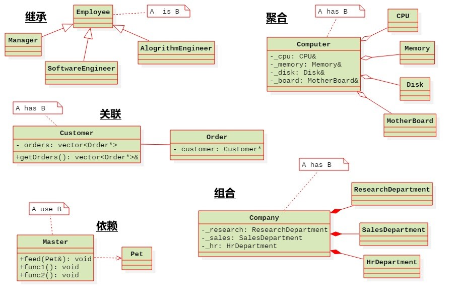
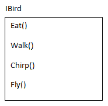
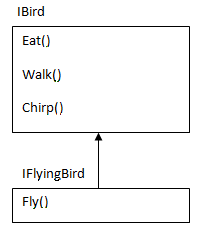
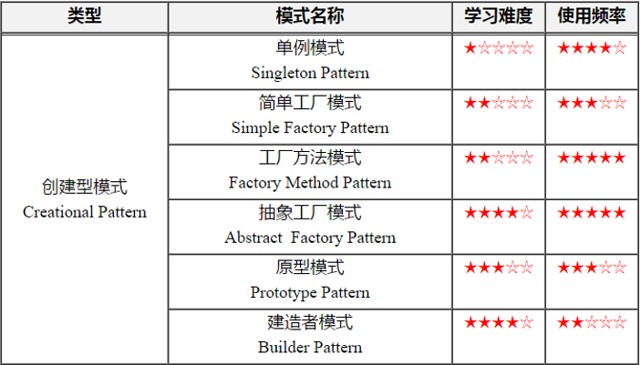
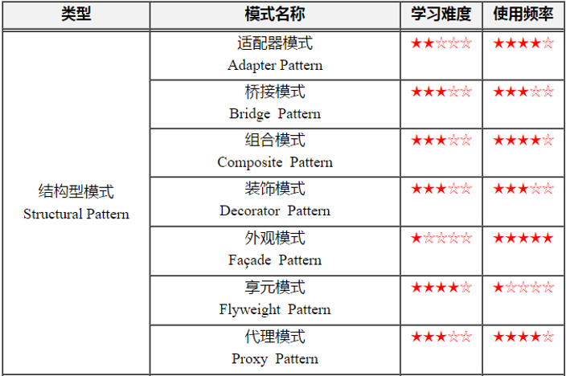
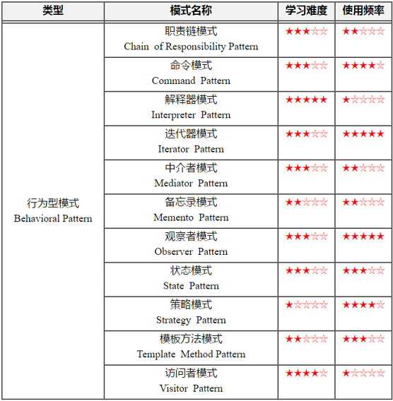

## 智能指针

### unique_ptr

1. 禁止复制、赋值运算，这是独享所有权的智能指针；但可以接受右值（内部定义了具有移动语义的函数）

2. 占用大小为8B，有一个对象的地址

3. get()方法获取资源的地址

   ```C++
   //Returns a pointer to the managed object or nullptr if no object owned.
   pointer get() const noexcept;
   ```

4. reset()方法

   ```C++
   //Replaces the managed object.
   void reset( pointer ptr = pointer() ) noexcept;
   //ptr - pointer to a new object to manage
   ```

5. release()方法

   ```C++
   //Releases the ownership of the managed object if any. 
   pointer release() noexcept;
   ```

### shared_ptr

1. 引用计数采用的是源自操作，无线程安全的风险

2. 可以用另一个共享指针来拷贝构造或者赋值运算

3. 也可以用右值初始化，内部定义了具有移动语义的函数

4. 占用大小为16B，一个指针指向对象，另外部分用于计数，计数肯定是在heap上进行的，但具体实现不清楚

5. **循环引用问题**：导致内存泄漏

   + 通过将(两个强引用)变为(weak_ptr和shared_ptr联合使用)可以解决

6. get()方法

   ```C++
   T* get() const noexcept;
   ```

7. reset()方法

   ```C++
   void reset() noexcept; //deprived of the ownership;
   
   template< class Y >void reset( Y* ptr );//replace with ptr
   
   //Deleteot of our own is allowed
   template< class Y, class Deleter >void reset( Y* ptr, Deleter d );
   ```

   

### 智能指针的滥用

1. 将一个原生裸指针交给两个智能指针（同类或者不同类）托管，都会析构两次

```C++
void test0()
{
	Point * pt = new Point(1, 2);
	unique_ptr<Point> up(pt);
	unique_ptr<Point> up2(pt);//析构两次
}
void test1()
{
	Point * pt = new Point(1, 2);
	//执行复制或者赋值时，引用计数加1，这里两个指针都是用原生裸指针初始化的
    //use_count()都等于1，最后会析构两次
	shared_ptr<Point> up(pt);
	shared_ptr<Point> up2(pt);
	cout<<up.use_count()<<endl<<up2.use_count()<<endl;
}
```

2. 类内部无法获得指向this的智能指针

   + 原因是调用时会自动

   ```C++
   class Point
   {
   //......
   public:    
     	shared_ptr<Point> addPoint(Point * pt)
   	{
   		this->_x += pt->_x;
   		this->_y += pt->_y;
   		return shared_ptr<Point>(this); //会析构三次？？？理解？？？
           //因为返回时，相当于将一个原生裸指针交给了另一个智能指针
           
           //当public继承了std::enable_shared_from_this<Point>，后，可以使用下面方式，返回一个真正的共享指针，引用计数+1，最后也只会析构两次
           //声明：shared_ptr<T> shared_from_this();
           //所以只能用继承的方式，才能使用this指针传入，才能return出这个shared_ptr
   		return shared_from_this();
   	}
   }
   void main()
   {
   	shared_ptr<Point> sp(new Point(1, 2));
   	shared_ptr<Point> sp2(new Point(11, 12));
   	shared_ptr<Point> sp3(sp->addPoint(sp2.get()));
   }

   ```
   
   

## 面向对象

### 面向对象过程

1. 面向对象分析OOA 
   + OOA是在一个系统的开发过程中进行了系统业务调查以后，按照面向对象的思想来分析问题。
   + OOA(面向对象的分析)模型由5个层次(主题层、对象类层、结构层、属性层和服务层)和5个活动(标识对象类、标识结构、定义主题、定义属性和定义服务)组成。
2. 面向对象设计OOD
   + 主要作用是对OOA分析的结果作进一步的规范化整理，以便能够被OOP直接接受。
   + 特点
     + 面向对象
     + 复用
     + 能以最小的代价满足变化
     + 不用改变现有代码满足扩展
   + UML（Unifed Modeling Language）统一建模语言
3. 面向对象编程OOP
   + 决定你要的类；
   + 给每个类提供完整的一组操作；
   + 明确地使用继承来表现共同点。

### 类与类之间的关系

1. 垂直方向

   1. A is B
      + 继承（泛化）：类与类之间的继承关系和类与接口之间的实现关系
        + 空心三角箭头

2. 水平方向

   1. A has B
      + 关联(Association)：发生关联关系的两个类，类B成为类A的某种属性。eg学生和老师
        + 单向关联（实线箭头）和双向关联、自身关联（直线），还有多维关联（菱形加直线）
        + 彼此不负责对方的生命周期
        + 通过指针或引用
      + 聚合(Aggregation)：聚合用来表示集体与个体之间的关联关系；成员对象是整体对象的一部分，但是成员对象可以脱离整体对象独立存在。eg班级与学生
        + 空心菱形箭头
        + 实现：数据成员，指针或引用
        + 整体和局部的关系：整体部分并不负责局部对象的销毁
      + 组合(复合)(Composition)：用来表示个体与组成部分之间的关联关系。eg学生与心脏
        + 实心菱形箭头
        + 实现：数据成员
        + 整体负责局部的生命周期
   2. A use B
      + 依赖(Dependency)：虚线箭头
        + 实现：函数
          + 作为函数的参数
          + 在函数内部创建B的对象
          + 在函数内部调用B的静态方法

   

3. 耦合性强弱

   + 依赖 < 关联 < 聚合 < 组合(继承) 

4. 参考 ：

   + [认识 UML 类关系——依赖、关联、聚合、组合、泛化](https://blog.csdn.net/K346K346/article/details/59582926)
   + [UML图中类之间的关系:依赖,泛化,关联,聚合,组合,实现](https://blog.csdn.net/hguisu/article/details/7609483)

### 5个基本设计原则SOLID

1. 单一职责原则(Single Responsibility Principle)

   + 一个类只做一件事，否则当只想使用其中一个方法的时候会带来不必要的耦合
   + 核心：解耦和增强内聚性

2. 开闭原则(Open Closed Principle)

   + 对扩展开放，对修改闭合。
   + 核心思想就是对抽象编程，而不对具体编程，因为抽象相对稳定

3. 里氏替换原则(Liscov Substitution Principle)

   + 核心思想：派生类必须能够替换其基类。
   + 实现的方法是面向接口编程：将公共部分抽象为基类接口或抽象类，通过提取抽象类，在子类中通过覆写父类的方法实现新的方式支持同样的职责

4. 接口分离原则(Interface Segregation Principle)

   + 核心思想：使用多个小的专门的接口，而不要使用一个大的总接口。一个类对另外一个类的依赖应该建立在最小的接口上，不要强迫依赖不用的方法，这是一种接口污染。

   + 就是要足够抽象

   + eg 存在不会飞的鸟

     

     

5. 依赖倒置原则(Dependency Inversion Principle)

   1. 核心思想：面向接口编程，依赖于抽象，即：
      + 高层模块不依赖于低层模块，二者都同依赖于抽象；
      + 抽象不依赖于具体，具体依赖于抽象。


### 设计模式

+ 创建型设计模式：主要用于描述如何创建对象

  

+ 结构型设计模式：主要用于描述如何实现类和对象的组合

  

+ 行为型设计模式：主要用于描述类或对象怎样交互以及怎样分配职责



## 编程

1. noexcept修饰符
   + noexcept可以用来修饰函数，在函数的后面加上noexcept，代表这个函数不会抛出异常，如果抛出异常程序就会终止。
   + 参考[《深入理解C++11》笔记--noexcept](https://blog.csdn.net/WizardtoH/article/details/80579131)
2. vim e + 文件名：可以在打开这个文件名，放buffer里
3. 查找 / + name , n next
4. `=default`：如果我们仅定义了有参构造函数，可以通过default关键字让默认构造函数恢复

## 其他

1. foo和bar就是外国人的张三、李四、王二麻子，只是一种随便的命名方式。
2. “软件开发唯一的真理是“软件一定会变化”

